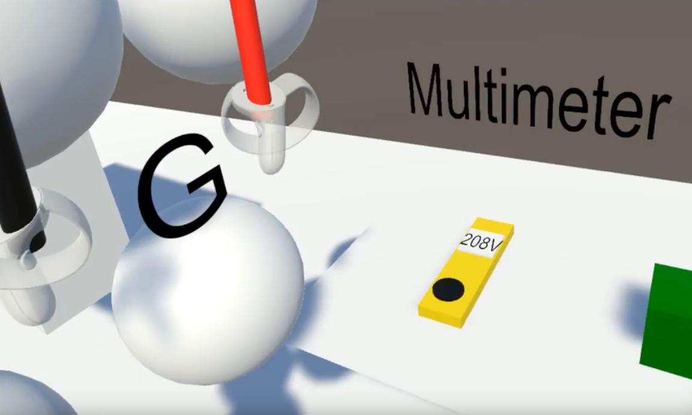
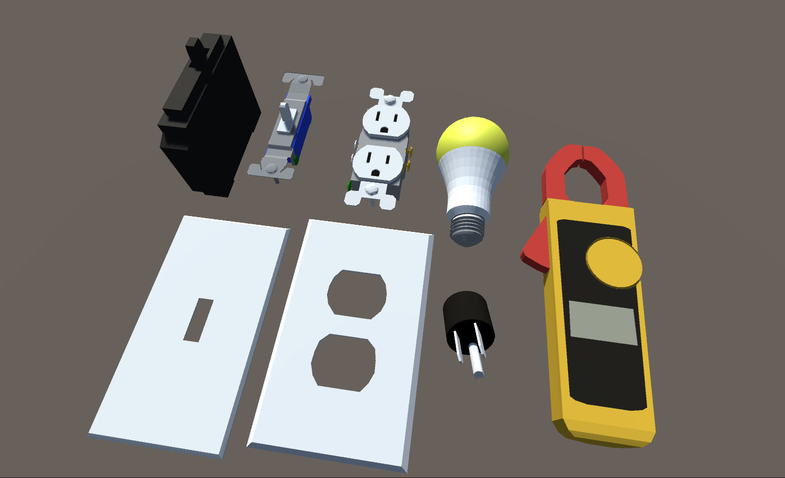

# Electrical Simulator

This project is to make a simple, but useful training program to be able to teach young electricians consepts about electricity in a safe way with visualizations you cannot get in the real world.

## Goals:
  * Fully functioning multimeter that behaves how you would expect it to in the real world
  * Have a library of different issues that may arrise and how to troubleshoot
  * Implement VR so the user can be immersed and because that's cool af
  * Record some voice overs that explain exactly what is going on
  * Implement troubleshooting. Something the user can interact with ie open boxes, connect wires with wirenuts, find faults
  * Injury system with an avatar? Show the effects a blast can do it a body ie arc burns or adc blasts

 
 ## Assets implemented

- Single pole breaker
- Light switch
- Light switch cover
- Duplex Receptical
- Duplex Receptical Cover
- LED
- Flute Multimeter

## Contributing to this project
This project was made on Unity3d version 2021.3.8f1. Everything SHOULD work if this repository is cloned into Assets.

My project is currently set up for Webgl so I can put demos on my website https://maulelecdemo.com.

## Working demos
*Webgl works natively on firefox and chrome*
  - Voltage https://voltage.maulelecdemo.com
